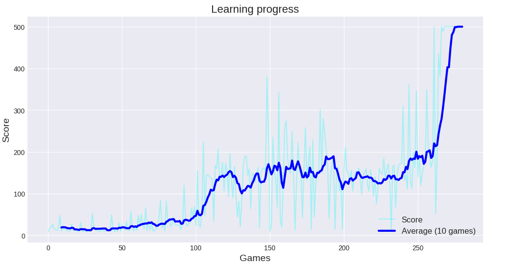
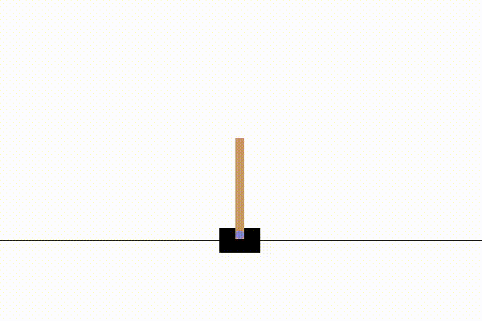

# Transfer Learning Experiment: CartPole to LunarLander-v3

This project explores the concept of Transfer Learning in Deep Reinforcement Learning.

The core idea is similar to a tennis player switching from singles (1v1) to doubles (2v2). The rules and the court dimensions change slightly, but the player doesn't need to relearn how to hit the ball. They transfer their core skills (physics, timing, stamina) to the new context.

I wanted to test if a Deep Q-Network (DQN) could do the same: learn the laws of physics on a simple environment (CartPole) and reuse that knowledge to learn a harder task (LunarLander) faster.

## Project Overview

The project is divided into progressive phases:

### Phase 1: Solving CartPole-v1 (Completed)
Before attempting any transfer, I needed a solid baseline. I implemented a DQN agent from scratch using PyTorch (no high-level RL libraries).
* **Architecture:** 3 fully connected hidden layers (128 units each).
* **Key components:** Experience Replay, Target Network, Epsilon-Greedy exploration.
* **Results:** The agent solves the environment consistently, reaching the max score of 500 around episode 300.

### Phase 2: Transfer from CartPole-v1 to LunarLander-v3 (In progress)
**Challenges:** *Negative Transfer Analysis:* We initially hypothesized that transfer learning could accelerate training on Acrobot-v1. However, results showed a negative transfer, caused by the fundamental misalignment of physical goals between the source (Stabilization) and target (Momentum) tasks. Detailed findings are discussed in the "Phase 2" section.
**Goal:** Reuse the physics knowledge (weights) acquired by the CartPole agent while quickly adapting to the new Acrobot control system.
* **Method:** We perform initial "Network Surgery" (replacing the input and output layers to match the new dimensions: 4→6 and 2→3). Then we train the model using the same strategy as in phase 1, changing only the hyperparameters and the initial brain state. We then compare the results by attempting to train a blank brain to Acrobot with the hyperparameters from phases 1 and 2.
     
* **Key components:** (Not yet)
* **Results:** (Not Yet)
  
### Phase 3: Pre & Post-processing Layers (Not yet Started)
**Goal:** Improve the quality of the transfer by adapting the signal *before* it reaches the pre-trained core.
* **Hypothesis:** Direct connection between raw LunarLander states and the CartPole hidden layers is suboptimal.
* **Method:** We will add dedicated **Adapter Layers** (pre/post-processing layers) to the architecture. The entire network is then trained using a **Differential Learning Rate** strategy.

    * The adapter layers use a high Learning Rate to learn quickly from scratch.
    * The "transferred" core layers (Hidden Layers) use a very low Learning Rate to gently fine-tune the learned physics features without destroying the original knowledge.

* **Key components :**
* **Results:**

### Phase 4: Oracle Network Architecture (Not yet started)
*That architectural term doesn't really exist to my knowledge; I didn't know what to call it.*

**Goal:** Train a completely new network for LunarLander that uses the old network as a tool. 
* **Method:** We're going to create a classic fresh neural network for LunarLander, except that between two layers, the neurons will not only be connected to the next layer, but they will also be connected to CartPole's brain, which will perform its usual calculation before passing it back to the next layer of neurons.
* **Concept:** The new brain decides how to interpret, how to use, and whether or not to listen to what the old brain tells it.
* **Key components :**
* **Results:**
## Installation

Install the required dependencies:

```bash
pip install -r requirements.txt
```

## 📝 Author's Note
This project was developed during my **Undergraduate studies**. 
It represents an educational exploration where I aimed to build algorithms manually (without high-level libraries) to deeply understand the mechanics of Loss Functions, Backpropagation, and Gradient Descent in Reinforcement Learning.

## Phase 1 : Solving CartPole-v1 

To solve CartPole, I used a Q-learning algorithm. I assumed that if the agent could maintain a good score 20 times in a row, then it was sufficient.

Why? Because for my experiments, I just need a brain that understands basic physical concepts like gravity to test my Transfer Learning algorithms.

Here are the training results using the specific seed:


Here is a satisfying GIF of the agent mastering the CartPole environment : 

